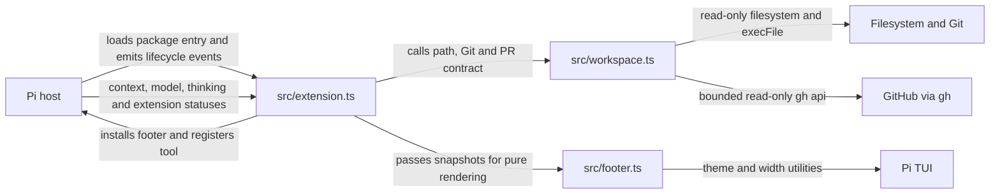
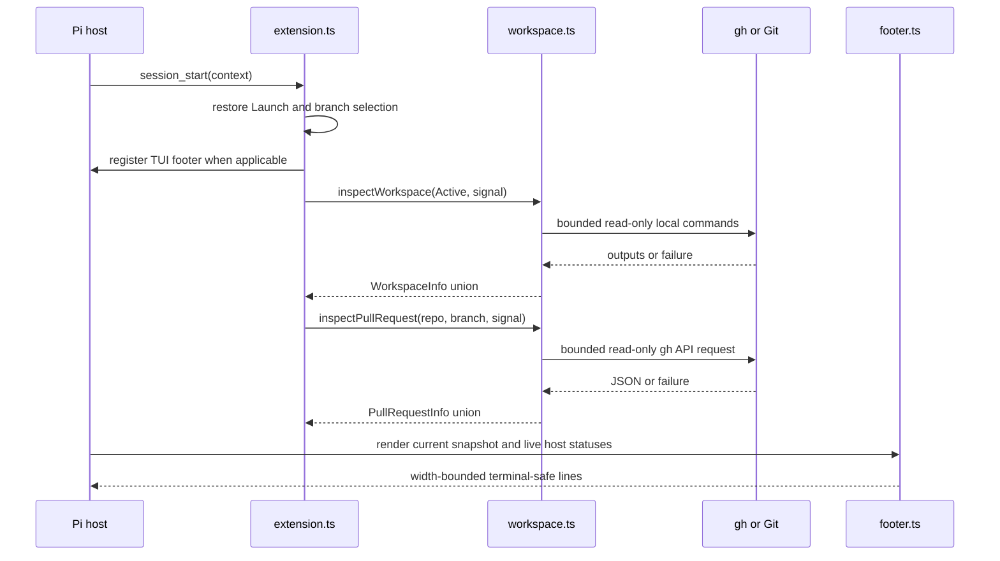

# Architecture

Status: current integrated system; no proposed runtime modules.
Evidence: baseline `60d738faa2b2264005717e599c4a917f69c59419`, all `src/` and `test/` files, `package.json`, and installed Pi 1.0.2 public loader/runtime APIs inspected on 2026-10-04.

## System and module map

| Module/path | Purpose | Public entry point | Dependencies |
| --- | --- | --- | --- |
| `package.json` | Pi package metadata and test wiring | `pi.extensions[0]` → `src/extension.ts` | Host-provided peer packages |
| `src/extension.ts` | Pi adapter: tool, session state, restoration, refresh/cache, cancellation, footer lifecycle | Default extension factory | Public Pi/TypeBox APIs, workspace functions, footer renderer |
| `src/workspace.ts` | Path normalization and truthful local Git/GitHub/PR inspection | `resolveActivePath`, `inspectWorkspace`, `inspectPullRequest` and result types | Node filesystem/path/child-process only |
| `src/footer.ts` | Pure, theme-aware, width-safe, terminal-safe rendering | `renderFooter`, `safeText`, `FooterSnapshot` | Pi types, Pi TUI width helpers, workspace types only |
| `test/workspace.test.ts` | Domain/contract coverage | Node test file | Disposable Git repositories and fake executables |
| `test/footer.test.ts` | Renderer coverage | Node test file | Installed host TUI through Jiti |
| `test/extension.test.ts` | Package/host/lifecycle integration | Node test file | Real installed Pi loader/runtime, disposable fixtures, fake `gh` |

The reusable domain module never depends on UI/process-exit/session state. The renderer never performs I/O. The Pi adapter owns all orchestration and does not duplicate Git/PR parsing or presentation rules.

## Representative flows

### Session start and refresh

Local inspection runs after tool completion and on a 15-second TUI timer. PR lookup is keyed by repository name/URL and branch with a 60-second TTL; it does not run per redraw or every tool completion. Render reads current context/model/thinking/status values and performs no external work.

### Active selection and failure behavior

The registered tool resolves a relative path from Launch, validates an existing directory, and normalizes a Git path to its checkout root. Only after successful resolution and ownership/cancellation checks does it replace Active, cancel stale work, and start refresh. The tool result stores `{ version: 1, path }`; Pi persists that result on the current session branch.

Invalid paths, resolution failures, cancellation, or session replacement throw without changing the previous Active path. Inspection failures become explicit `unknown`/`unavailable` values. Renderer text preserves that distinction; it never maps a failure to clean/no-PR.

## Data and contracts

`SessionState` in `src/extension.ts` is authoritative only for the live session: Launch, Active, selection generation, latest workspace/PR snapshots, PR cache, controllers, timer, and render callback. It is recreated on session start/tree events and disposed on shutdown. A same-session tree restore retains its PR cache; a new session receives a new cache and Active starts at Launch.

Durable selection data lives only in successful `set_active_project` tool-result details on the selected Pi session branch. Restoration scans that branch, so abandoned history does not leak into navigation. There is no project/global settings write or cross-session database.

The workspace contract uses discriminated unions:

- Git: `none`, `unknown`, or `repository` with active/optional primary checkout.
- GitHub: validated `repository`, explicit `none`, or `unknown`.
- PR: validated `open`, successful `none`, `unavailable`, or `not-applicable`.

`dirty: null`, missing revision, detached branch, and unavailable primary checkout each have distinct meanings. `branch: null` is reserved for confirmed detached HEAD (`symbolic-ref` exit 1); a failed active-branch lookup makes Git and PR unavailable, while a failed primary-branch lookup makes only the Main information unavailable. GitHub API output is accepted only when repository identities, head branch, URL, state, count, and page bounds validate.

## Critical invariants

| Must remain true | Relevant code | Test/check or known gap |
| --- | --- | --- |
| Launch remains the original session launch path; Active is display-only | `restore` and tool handler in `src/extension.ts` | Display-only and restoration tests in `test/extension.test.ts` |
| The primary checkout belongs to Active's repository and is not inferred from Launch | `inspectWorkspace` in `src/workspace.ts` | Linked/missing/replaced-main tests |
| External errors never become clean/no-PR and raw stderr is not exposed | `command`, `checkout`, `inspectPullRequest` | Failure/redaction tests plus renderer state tests |
| Rendering performs no I/O and every line fits width | `renderFooter` in `src/footer.ts` | Widths 1–160 and pure snapshot tests |
| Untrusted terminal text cannot inject controls; other statuses keep SGR styles | `safeText` in `src/footer.ts` | Hostile-control renderer test |
| Branch/workspace switches and shutdown cannot accept stale async completions | refresh ownership checks in `src/extension.ts` | Stale work/disposal tests |
| GitHub network work is rate-limited by repository and branch | `refreshPR` cache/key in `src/extension.ts` | TTL/switch integration test |
| Package loading uses the explicit manifest entry and host peers | `package.json`, integration harness | Real installed Pi loader test |

## Where the next change belongs

A new workspace status field starts in the appropriate `WorkspaceInfo` union and inspection logic in `src/workspace.ts`, with boundary/failure tests in `test/workspace.test.ts`. If it is displayed, extend `FooterSnapshot`/`renderFooter` and renderer tests. Only change `src/extension.ts` when collection cadence, persistence, or lifecycle orchestration changes; then add real-host integration coverage.

A new footer-only presentation state belongs in `src/footer.ts` and must use a supplied snapshot, never call Git or `gh`. A new host lifecycle behavior belongs in `src/extension.ts` and must preserve disposal and stale-result guards. Do not expose private parsers or add a generic service layer merely to pass data across these existing seams.

## Evolution and known limits

- Workspace result/tool detail changes are compatibility changes: update consumers and contract/integration tests together. Keep `version: 1` until an approved migration need exists.
- Replacing `gh` belongs behind `inspectPullRequest`'s existing result contract; do not leak client-specific response types into extension/render code.
- Cache/polling changes require measured need plus switch, expiry, cancellation, and shutdown coverage.
- Public GitHub URL forms are supported; GitHub Enterprise/arbitrary SSH aliases and outbound fork-to-upstream discovery are not inferred. Add them only from explicit requirements with unambiguous identity rules.
- Local Git reads form a non-atomic snapshot during concurrent repository changes. A full transaction is not available; failures remain visible.
- Active can be stale when the agent omits the explicit signal. This is a product trade-off, not an automatic-tracking implementation bug.
- Static typecheck/lint/build/CI, live authenticated GitHub, Windows, and manual interactive-theme validation are not established. See the adoption gaps in `docs/conventions.md`.

The diagrams use standard Mermaid flowchart/sequence syntax. On 2026-10-04 both rendered with zero warnings in the already installed `grok-mermaid` 0.2.3 renderer used by Pi. This validates Pi's terminal renderer, not every browser Mermaid implementation.

## Technical decisions

- [Agent-reported active workspace](decisions/agent-reported-active-workspace.md) — explicit branch-local display state instead of inferred or cwd-enforcing behavior.
