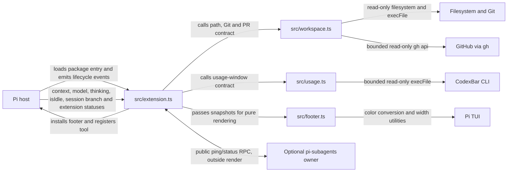
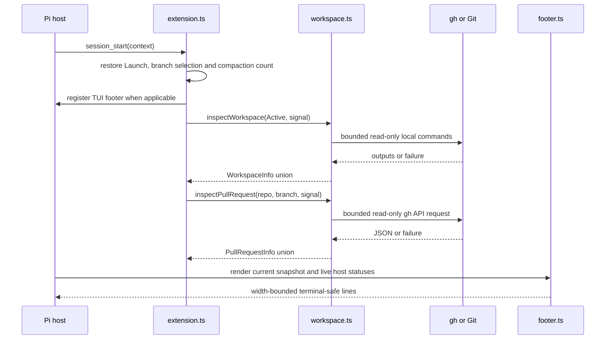

# Architecture

Status: current integrated system; no proposed runtime modules.
Evidence: current `src/` and `test/` files, `package.json`, installed Pi 1.0.2 and pi-subagents 0.76.0 public contracts inspected for the native v9 integration on 2026-10-05; CMP compaction collection verified against installed Pi 1.0.4 on 2026-10-06; USG built against recorded CodexBar 0.60.3 output and its [CLI documentation](https://github.com/steipete/CodexBar/blob/main/docs/cli.md) on 2026-10-07.

## System and module map

| Module/path | Purpose | Public entry point | Dependencies |
| --- | --- | --- | --- |
| `package.json` | Pi package metadata and test wiring | `pi.extensions[0]` → `src/extension.ts` | Host-provided peer packages |
| `src/extension.ts` | Pi adapter: tool, motion command, session state, restoration, compaction count, refresh/cache, cancellation, footer and animation lifecycle | Default extension factory | Public Pi/TypeBox APIs, workspace functions, footer renderer |
| `src/workspace.ts` | Path normalization and truthful local Git/GitHub/PR inspection | `resolveActivePath`, `inspectWorkspace`, `inspectPullRequest` and result types | Node filesystem/path/child-process only |
| `src/usage.ts` | Explicit provider list, read-only CodexBar invocation and parsing into a discriminated usage-window result | `USAGE_PROVIDERS`, `fetchUsage` and result types | Node child-process only |
| `src/footer.ts` | Pure, fixed-palette, width-safe, terminal-safe rendering and time-to-decoration frames | `renderFooter`, `safeText`, `FooterSnapshot`, motion functions, `usageRepaintDelay` | Node path helpers, Pi types/TUI color and width helpers, workspace and usage types only |
| `test/workspace.test.ts` | Domain/contract coverage | Node test file | Disposable Git repositories and fake executables |
| `test/usage.test.ts` | CodexBar contract coverage | Node test file | Fake `codexbar` executables on PATH |
| `test/footer.test.ts` | Renderer coverage | Node test file | Installed host TUI through Jiti |
| `test/extension.test.ts` | Package/host/lifecycle integration | Node test file | Real installed Pi loader/runtime, disposable fixtures, fake `gh` and `codexbar` |

The reusable domain modules never depend on UI/process-exit/session state. The adapter supplies the home directory in `FooterSnapshot` for display abbreviation, the wall-clock time for USG countdowns, and the monotonic time as a decoration frame; the renderer never reads the environment or a clock and performs no I/O. The Pi adapter owns all orchestration and does not duplicate Git/PR parsing or presentation rules.

## Representative flows

### Session start and refresh

Local inspection runs after tool completion and on a 15-second TUI timer. The compaction count is not polled; see [CMP compaction count](#cmp-compaction-count). PR lookup is keyed by repository name/URL and branch with a 60-second TTL; it does not run per redraw or every tool completion. Render reads current context/model/thinking/status values and performs no external work.

### Decorative motion

The installed TUI footer owns one `MotionState` and at most one unref'd decoration timeout. The adapter supplies monotonic `performance.now()` time and a fresh cryptographic 32-bit seed to `startMotion(snapshot, now, seed, boot)`. Each render builds a fresh snapshot, calls `advanceMotion`, then projects `motionFrame`. `nextMotionDelay` schedules the next decoration step, preserving an already-earlier wake. A wake advances state against the last rendered snapshot before repainting/rearming; the ensuing render observes current host values. The wake performs no telemetry collection. Plans are generated once per event, not per frame; late wakes do not run an unbounded catch-up loop.

`/footer-motion` sets a session-local flag that survives same-session tree restore and resets for a new session or extension reload. Off clears the decoration timeout and renders the settled frame; on restarts with a fresh seed and current snapshot without replaying boot or accumulated off-time changes. Git/PR and activity collection continue independently. Replacement, tree restore and shutdown dispose owned work; stale components cannot stop replacements. Non-TUI modes install neither a footer nor display-only fleet collection/PNYTL observation.

### ROOT and optional fleet activity

`FooterSnapshot.activity` is always supplied by the adapter: `{ working: !ctx.isIdle(), units: number | null }`. Root state is sampled on every render, with explicit repaints on `agent_start`, `agent_end`, and `agent_settled`. `agent_end` is not final settlement: Pi may retry, compact or continue; it clears run-active before delivering `agent_settled`. Never infer ROOT from tools or AU.

A footer-owned collector uses public `subagents:rpc:v1:request`, `subagents:rpc:v1:reply:<requestId>` and `subagents:rpc:v1:ready` channels directly, without importing the optional package. Each collection checks `ping` protocol version, current session ID, and `capabilities.fleetStatus.version === 1`, then requests untargeted `status`. It validates reply envelope/version/request ID/optional method/success, fleet version, safe nonnegative integer `totalActive` and `omitted`, and entry-window consistency. Unknown fields are ignored; entries are not counted as the total. Missing owner, unsupported capability, errors, invalid data and timeout publish null (`? AU`). Exact zero requires a valid successful sample.

Only one request is outstanding locally. Each reply listener and its unref'd two-second timeout are installed before emit, and removed on completion/cancellation. Pi's event bus invokes handlers but does not await their asynchronous completion. Normal collection is five seconds after completion; lifecycle/tool/ready requests coalesce with 250 ms delay and a minimum one-second start-to-start interval. A burst during collection produces at most one deferred refresh. A valid same-session ready notification cancels a predecessor's pending reply and invalidates its sample. Session/component identity and unique request IDs reject stale replies; tree/new-session/footer replacement/shutdown clear polling, reply and ready listeners. There is no per-frame RPC, Git or GitHub work.

AU means **Active Units**, the owner's native active-work total: running, queued/pending items and workflow containers (one per workflow), not an exact running-agent count. The public entry window is bounded but the total is not capped. This is process-local/current-owner data, not a cross-process fleet inventory. The owner normally serves restored in-memory projections; missing/stale/unrestored projections fall back to its executor-backed status, which can read artifacts. Ready follows synchronous session reset/restore, but does not guarantee every restoration succeeded. The footer trusts validated public DTOs and does not scrape private state. Timeout detaches the client; the public protocol has no request cancellation, so it cannot abort work already executing in the optional owner. Last successful data stays visible during a bounded refresh, then becomes Unknown on failure. No instantaneous/background-event-complete freshness guarantee is claimed.

Contract sources in the installed packages: Pi `docs/extensions.md`, `dist/core/event-bus.{d.ts,js}`, `dist/core/agent-session.js` and `dist/core/extensions/runner.js`; pi-subagents `docs/extension-api.md`, `src/extension/rpc.{d.ts,js}`, `src/extension/index.js` and `src/runs/background/async-job-tracker.js`. Production uses only Pi public imports and the documented event contract.

### Ponytail status integration

The optional integration consumes the **existing** Ponytail 4.13.0 `setStatus("ponytail", text)` output through Pi's public footer status map. It neither imports Ponytail nor uses a mode RPC. Only recognized content of this exact key moves into the dedicated PNYTL plate; the host map is never changed. Every other key, and any unrecognized Ponytail warning/format, stays in EXT with existing sanitization/styling/wrapping.

The adapter checks at most 512 UTF-16 code units before stripping SGR. It accepts only the anchored producer format: `○` or `●`, ` 🐴 ponytail: `, then exactly `🌿 LITE`, `⚡ FULL`, `🔥 ULTRA` or ` REVIEW` (the latter includes the producer's extra space for its absent legacy icon). Other controls, extra text, icon/label mismatches and incompatible formats yield UNK while retaining raw text for safe display. Current mode is never inferred from defaults, prompts or session entries. The leading dot is Ponytail's own activity signal (`●` from its `agent_start` to `agent_end`): it is passed as `FooterSnapshot.ponytailActive` and drives only the plate's activity light, never a mode transition. A dot-only status change requests a repaint like a mode change.

OFF is special: Ponytail explicitly calls `setStatus("ponytail", undefined)`. Pi deletes the map key, making OFF indistinguishable from never emitted/hidden/reset **in the map alone**. The footer therefore narrowly observes that public method, forwarding the original receiver, arguments, return and errors first. It captures only key `ponytail`, with current session/component/UI ownership checks. There are no private runner imports or upstream status suppression. A one-shot unref'd next-turn initialization timer changes CHK to UNK when no evidence arrives; there is no polling or query timer. Render reads only in-memory host data.

**Compatibility boundary and activation:** enable Ponytail status emission and load pi-status-bar **before** Ponytail. Real Pi 1.0.4 tests prove its public event contexts share a UI object and that local package order determines these handlers' order. The observer attaches synchronously with the footer factory before subsequent Ponytail session handlers. Known startup text is recoverable in either order; an initial OFF clear that occurred before attachment is not, and stays UNK until a later explicit emission. New/resume/fork/tree reset OFF evidence. Same-session footer replacement retains observed OFF; changing the UI object invalidates it. Rebinding occurs on session restoration or next render after public UI replacement; a clear before rebinding is not recoverable. Normal host reload binds UI before session_start, so the activation order covers it. This is a tested shared-UI assumption, **not a documented status subscription guarantee**; revalidate when upgrading Pi/Ponytail.

Each UI object has one reusable narrow tap in a WeakMap, with one active observer callback. Disposal clears the initialization timer and callback, and restores the original method only if our wrapper is still the current method. A later foreign wrapper is never overwritten; when it delegates to our tap, reuse avoids stacking wrappers across replacements. A non-delegating replacement prevents clear observation; known map content still works, but no unseen clear can be inferred. Old UI callbacks cannot publish to the new UI. Non-TUI installs no observer. Fallback footers continue receiving original host status data.

`FooterSnapshot.ponytail` remains optional for renderer compatibility; native snapshots always supply it. Pure renderer/motion contracts are unchanged: two random subsets on a real known-mode change, immediate current text/ink, no ambient plate effects, no off-time replay. The existing decoration timer and retained flash budget remain independent of status observation. See [design](design.md#motion).

Sources inspected read-only: Pi 1.0.4 `dist/core/extensions/runner.js`, `dist/core/footer-data-provider.js`, `dist/core/agent-session.js`, `dist/modes/interactive/interactive-mode.js`, public extension types/docs; Ponytail 4.13.0 `pi-extension/index.js` and `hooks/ponytail-config.js`. The portable suite uses synthetic producer fixtures with the real Pi loader/runner. A separate explicit-prerequisite, no-install supplemental check exercised the actual installed Ponytail producer with isolated UI/sessions/config, including startup/load order, commands, legacy restore, hidden output, default versus current, and disposal. No live settings/install/reload occurred.

### USG usage polling

`src/usage.ts` owns the provider list (`codex`, `claude`, `kimi`, in display order) and runs `codexbar usage --provider <id> --format json --json-only` through `execFile`: explicit argv, no shell, `NO_COLOR=1`, a 60-second deadline, a 1 MiB output cap and an AbortSignal. The deadline and abort are handled manually rather than through execFile options: they settle the result at once, send SIGTERM only to a child that actually started (so CodexBar can stop its own provider work) and escalate to SIGKILL if it is still running five seconds later, so a stuck child never holds up a round. CodexBar documents this command as read-only; `--json-only` turns errors into JSON. The result union is `usage` (windows and `updatedAt`), `unavailable` (`timeout`, `cancelled` or `failed`) or `not-installed` (ENOENT). Any non-zero exit is `failed`: CodexBar exits 1 with an error payload whose message is untrusted and may name the account, so it is not parsed into state. A successful payload must be a one-element array for the requested provider. Windows are identified by `windowMinutes` rather than position (Kimi reports the week as primary, Codex has no primary): 300 is `5h`, 10080 is `wk`, other lengths and `extraRateWindows` are ignored, and the first of a duplicated length wins. Only finite `usedPercent` (else null, an unknown window), ISO `resetsAt` and `updatedAt` instants (else null) are kept; identity, email, credits, pace, source and descriptions are never copied.

The adapter runs the collector only with an installed TUI footer, like the fleet collector. Each footer starts a round that fetches all three providers concurrently, one call per provider in flight, and arms one unref'd five-minute timeout after the round completes. Results are applied only when the collector, session and session ID still own them and the call was not aborted; disposal (footer replacement, tree restore, new session, shutdown) aborts every in-flight call and clears the timer. `SessionState.usage` caches `installed` and per-provider state across same-session restores, like the PR cache: a success replaces the provider's sample (stamped with receipt time), a failure keeps the last good sample and records `timeout` or `failed`, and ENOENT marks CodexBar not installed and clears the cache; the next round retries, so installing CodexBar later shows the row. `installed` stays unknown until the first call resolves, and only `true` supplies `FooterSnapshot.usage`.

Render reads only that cache plus `Date.now()` as `usage.now`. The renderer derives squares, countdowns and staleness, and lays each provider out in a fixed column from the window shape declared in its `USAGE` presentation entry (a layout declaration; `src/usage.ts` parsing is independent of it). `usageRepaintDelay` reports when displayed USG text can next change (a countdown minute, a stale-age step or the 15-minute stale mark). The adapter arms one unref'd repaint timeout for that moment from each render, independent of motion, and clears it on disposal.

USG decoration memory in `MotionState` is pure and driven by the snapshots `advanceMotion` observes at the supplied monotonic `now`: each window's sample stamp, lit count and edge period; burn-outs (a newer stamp with fewer lit squares); `usageShown`, whether the row was present; `usageBoot`, when the row appeared (absent to present, including after it was hidden, or present at a booting `startMotion`); and `usageFill`, each provider's fill-in start. The row boot is the draw-in alone and schedules no fill-ins. Once it has ended, a provider that gains data (from none) fills in from `now`; data that arrives during a row boot gets no fill-in, then or later. A newer sample never restarts a fill-in, and a running row boot or fill-in starts no burn-out. `motionFrame` projects these as `usageBoot` (ticks since the row booted, for `USAGE_BOOT_TICKS`), `usageFill` and per-window `usage` effects (edge pulse step or burn), suppressing every USG effect during the row boot and a window's pulse during its fill-in or burn-out. The renderer turns `usageBoot` into the draw-in front: `(k + 1)·USAGE_SWEEP_CELLS_PER_TICK` cells for squares lines and `k·USAGE_SWEEP_CELLS_PER_TICK` for text rows, measured from each USG line's left edge. Cells past the front are omitted (padded with blank field), the front's cells are repainted `LOCKED` from the line's plain characters, and the rest keeps its pre-styled settled text through `truncateToWidth`; this relies on every USG character being one cell wide. `USAGE_BOOT_TICKS` is derived from the declared shapes: the widest natural row (plate, gap and every column's declared windows plus room for one undeclared window where one exists: 78 cells today) divided by the sweep, plus one tick for the text row. `startMotion(…, false)` (motion resumed) records the current row and data without a boot or fill-in, so nothing that happened while motion was off is replayed. Row-boot front and fill-in wakes come from `nextMotionDelay` on the 50 ms tick, and pulse and burn steps on exact millisecond boundaries, through the single decoration timeout; they never fetch. The adapter needs no USG-specific motion wiring: a collector result requests a render, that render's `advanceMotion` observes the transition and the following `schedule` arms the next wake.

### CMP compaction count

`FooterSnapshot.compactions` is the number of `type: "compaction"` entries on `ctx.sessionManager.getBranch()`: successful compactions persisted on the selected branch, including ones inherited from before a branch point. Abandoned siblings (other `getEntries()` paths), `branch_summary` entries, context projections and token drops are not counted. Pi appends nothing for failed or cancelled attempts (`session_compact_failed`), so they cannot raise the count.

The count is held in `SessionState` and recounted, never incremented, so duplicate events cannot double-count. `restore` computes it on `session_start` (startup, new, resume, fork, reload) and `session_tree`. Pi's manual and automatic compaction append the entry and then await `session_compact`, which recounts and repaints when the value changed. Extension `turn_end`/`agent_before_settle` boundary drafts can also persist compactions without `session_compact`; they commit before the next `turn_start` (count-only handler) or `agent_end`/`agent_settled` (the existing ROOT handler, which now also recounts). Every recount requires the current, undisposed session and a matching session ID. Render reads the cached number and never walks the branch, so motion off still shows the current count.

Contract sources in installed Pi 1.0.4: `docs/extensions.md` (reconstruct branch state from `getBranch()`), `docs/compaction.md`, `docs/session-format.md`, `dist/core/session-manager.d.ts` (`ReadonlySessionManager.getBranch`, `CompactionEntry`, `BranchSummaryEntry`), `dist/core/extensions/types.d.ts` (`SessionCompactEvent`, `SessionCompactFailedEvent`, `CompactionEntryDraft`, `TurnStartEvent`) and `dist/core/agent-session.js` (`compact`, `_runAutoCompaction`, `_applyBoundaryDrafts`, `_dispatchTurnEndBoundary`, `_runBeforeSettleBoundary`, `_emitAgentSettled`). Integration tests emit these events in the same order against a real session manager; they do not run a model-backed compaction.

### Active selection and failure behavior

The registered tool resolves a relative path from Launch, validates an existing directory, and normalizes a Git path to its checkout root. Only after successful resolution and ownership/cancellation checks does it replace Active, cancel stale work, and start refresh. The tool result stores `{ version: 1, path }`; Pi persists that result on the current session branch.

Invalid paths, resolution failures, cancellation, or session replacement throw without changing the previous Active path. Inspection failures become explicit `unknown`/`unavailable` values. Renderer text preserves that distinction; it never maps a failure to clean/no-PR.

## Data and contracts

`SessionState` in `src/extension.ts` is authoritative only for the live session: Launch, Active, selection generation, latest workspace/PR snapshots, PR cache, controllers, refresh timer, render callback, motion flag, footer animation, optional fleet collector/PNYTL observer, nullable AU sample, PNYTL clear evidence/display state, branch compaction count, and the CodexBar collector, usage cache and USG repaint timer. It is recreated on session start/tree events and disposed on shutdown. A same-session tree restore retains its PR cache and motion choice; a new session receives a new cache, motion on, and Active at Launch.

Durable selection data lives only in successful `set_active_project` tool-result details on the selected Pi session branch. Restoration scans that branch, so abandoned history does not leak into navigation. The compaction count is derived from Pi's own branch entries and is never written by this extension. There is no project/global settings write or cross-session database.

The workspace contract uses discriminated unions:

- Git: `none`, `unknown`, or `repository` with active/optional primary checkout.
- GitHub: validated `repository`, explicit `none`, or `unknown`.
- PR: validated `open`, successful `none`, `unavailable`, or `not-applicable`.
- Usage: `usage` with only the windows CodexBar reported (each with a nullable used percent and reset time), `unavailable` with a fixed reason, or `not-installed`. An absent window is unreported; a null percentage is unknown, never full or empty.

`dirty: null`, missing revision, detached branch, and unavailable primary checkout each have distinct meanings. `branch: null` is reserved for confirmed detached HEAD (`symbolic-ref` exit 1); a failed active-branch lookup makes Git and PR unavailable, while a failed primary-branch lookup makes only the primary-checkout information in workspace inspection data unavailable. GitHub API output is accepted only when repository identities, head branch, URL, state, count, and page bounds validate.

## Critical invariants

| Must remain true | Relevant code | Test/check or known gap |
| --- | --- | --- |
| Launch remains the original session launch path; Active is display-only | `restore` and tool handler in `src/extension.ts` | Display-only and restoration tests in `test/extension.test.ts` |
| The primary checkout belongs to Active's repository and is not inferred from Launch | `inspectWorkspace` in `src/workspace.ts` | Linked/missing/replaced-main tests |
| External errors never become clean/no-PR and raw stderr is not exposed | `command`, `checkout`, `inspectPullRequest` | Failure/redaction tests plus renderer state tests |
| Rendering performs no I/O and every line fits width | `renderFooter` in `src/footer.ts` | Widths 1–160 (USG and PNYTL 1–280) in every state/motion frame and pure snapshot tests |
| USG never shows unknown or failed usage as success; raw CodexBar messages and account fields never reach state | `fetchUsage` in `src/usage.ts`, USG rendering in `src/footer.ts` | `test/usage.test.ts` whitelist/failure tests and renderer state tests |
| CodexBar runs only from the TUI collector, never per render; disposal aborts it and clears its timers | `collectUsage` and `scheduleUsageRepaint` in `src/extension.ts` | USG integration tests with a fake `codexbar` |
| CMP counts only persisted compactions on the selected branch, recounted on lifecycle events and never per render | `countCompactions` and `recount` in `src/extension.ts` | CMP integration test: abandoned sibling, branch summary, failures, duplicates, boundary drafts, restoration, shutdown, no render walk |
| Decoration never changes or delays displayed data and never starts collection; the one glyph change is the USG edge pulse's size-only `▪` on a lit square, which keeps its value and the lit count, and the USG row boot's draw-in leaves cells it has not reached blank, never a stale or wrong value | motion functions in `src/footer.ts`, animation and independent collector in `src/extension.ts` | Frame-equality, schedule, command, timer-disposal and no-extra-I/O tests; USG draw-in blank-or-settled and fill-in character checks and `▪`-placement tests |
| Untrusted terminal text cannot inject controls; other statuses keep SGR styles | `safeText` in `src/footer.ts` | Hostile-control renderer test |
| Branch/workspace switches and shutdown cannot accept stale async completions | refresh ownership checks in `src/extension.ts` | Stale work/disposal tests |
| GitHub network work is rate-limited by repository and branch | `refreshPR` cache/key in `src/extension.ts` | TTL/switch integration test |
| Package loading uses the explicit manifest entry and host peers | `package.json`, integration harness | Real installed Pi loader test |

## Where the next change belongs

A new workspace status field starts in the appropriate `WorkspaceInfo` union and inspection logic in `src/workspace.ts`, with boundary/failure tests in `test/workspace.test.ts`. If it is displayed, extend `FooterSnapshot`/`renderFooter` and renderer tests. Only change `src/extension.ts` when collection cadence, persistence, or lifecycle orchestration changes; then add real-host integration coverage.

The footer shows Active as `⑂ branch` and its colored status text when the workspace snapshot has a known branch and a GitHub repository name, which the header shows as `owner/repository`; otherwise it shows Active's parent/current path, with Git details wrapping on an unnumbered continuation after the complete path. Launch (Pi's working directory) appears as a grey `cwd` line in the header spacer row only when its stored path differs from Active's, a pure snapshot comparison with no path I/O. The header omits the full PR URL. The context readout renders host `ContextUsage.tokens` in the scale's unit. The adapter resolves `FooterSnapshot.compactionReserve` from `pi.getSettings()` and the current model on every snapshot, mirroring Pi 1.0.4 `SettingsManager.getCompactionSettings` (absent when auto-compaction is disabled or the setting is invalid); the renderer then scales tokens to `window − reserve` for the gauge, tone, numeral and readout. Without a usable reserve, host percent drives them against the full window. Primary-checkout metadata remains part of the workspace result contract and inspection flow, but is not rendered or targeted by footer motion.

A new footer-only presentation state belongs in `src/footer.ts` and must use a supplied snapshot, never call Git or `gh`. A new host lifecycle behavior belongs in `src/extension.ts` and must preserve disposal and stale-result guards. Do not expose private parsers or add a generic service layer merely to pass data across these existing seams.

## Evolution and known limits

- Workspace result/tool detail changes are compatibility changes: update consumers and contract/integration tests together. Keep `version: 1` until an approved migration need exists.
- Replacing `gh` belongs behind `inspectPullRequest`'s existing result contract; do not leak client-specific response types into extension/render code.
- Cache/polling changes require measured need plus switch, expiry, cancellation, and shutdown coverage.
- Public GitHub URL forms are supported; GitHub Enterprise/arbitrary SSH aliases and outbound fork-to-upstream discovery are not inferred. Add them only from explicit requirements with unambiguous identity rules.
- Local Git reads form a non-atomic snapshot during concurrent repository changes. A full transaction is not available; failures remain visible.
- Active can be stale when the agent omits the explicit signal. This is a product trade-off, not an automatic-tracking implementation bug.
- USG depends on CodexBar's JSON shape (verified against 0.60.3 samples) and treats a provider without 5H/WK windows as `none`. Codex and Claude fetches take about 20 seconds; the five-minute poll is not tuned from measurements. A new provider means a new entry in `USAGE_PROVIDERS` plus a renderer tag/palette/declared-window entry, not a registry. A provider that starts reporting an undeclared window widens its column until its declaration is updated.
- Static typecheck/lint/build/CI, live authenticated GitHub, live CodexBar, live fleet-owner activity, Windows, and manual interactive-terminal/motion validation are not established. See the adoption gaps in `docs/conventions.md`.

The diagrams use standard Mermaid flowchart/sequence syntax. The pre-v9 diagrams rendered without warnings in Pi's installed `grok-mermaid` 0.2.3 on 2026-10-04. The added optional-fleet and USG edges have not been separately rendered; no current diagram-rendering gate is claimed.

## Technical decisions

- [Agent-reported active workspace](decisions/agent-reported-active-workspace.md) — explicit branch-local display state instead of inferred or cwd-enforcing behavior.
