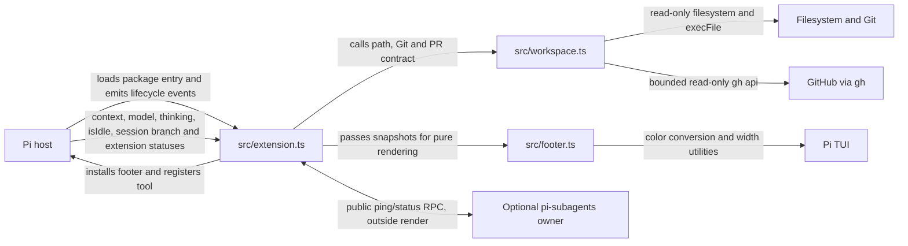
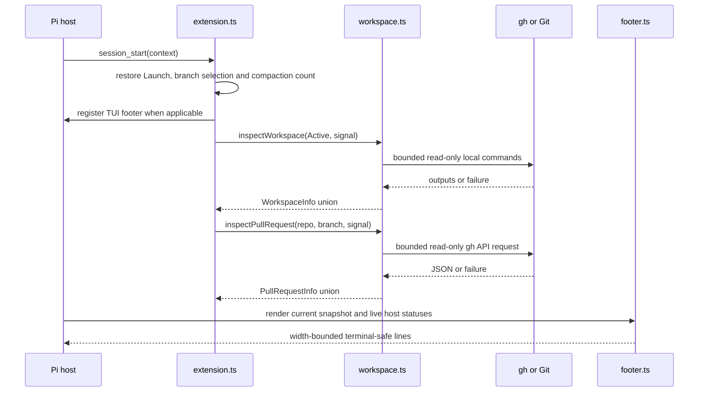

# Architecture

Status: current integrated system; no proposed runtime modules.
Evidence: current `src/` and `test/` files, `package.json`, installed Pi 1.0.2 and pi-subagents 0.76.0 public contracts inspected for the native v9 integration on 2026-10-05; CMP compaction collection verified against installed Pi 1.0.4 on 2026-10-06.

## System and module map

| Module/path | Purpose | Public entry point | Dependencies |
| --- | --- | --- | --- |
| `package.json` | Pi package metadata and test wiring | `pi.extensions[0]` → `src/extension.ts` | Host-provided peer packages |
| `src/extension.ts` | Pi adapter: tool, motion command, session state, restoration, compaction count, refresh/cache, cancellation, footer and animation lifecycle | Default extension factory | Public Pi/TypeBox APIs, workspace functions, footer renderer |
| `src/workspace.ts` | Path normalization and truthful local Git/GitHub/PR inspection | `resolveActivePath`, `inspectWorkspace`, `inspectPullRequest` and result types | Node filesystem/path/child-process only |
| `src/footer.ts` | Pure, fixed-palette, width-safe, terminal-safe rendering and time-to-decoration frames | `renderFooter`, `safeText`, `FooterSnapshot`, motion functions | Node path helpers, Pi types/TUI color and width helpers, workspace types only |
| `test/workspace.test.ts` | Domain/contract coverage | Node test file | Disposable Git repositories and fake executables |
| `test/footer.test.ts` | Renderer coverage | Node test file | Installed host TUI through Jiti |
| `test/extension.test.ts` | Package/host/lifecycle integration | Node test file | Real installed Pi loader/runtime, disposable fixtures, fake `gh` |

The reusable domain module never depends on UI/process-exit/session state. The adapter supplies the home directory in `FooterSnapshot` for display abbreviation and the current time as a decoration frame; the renderer never reads the environment or a clock and performs no I/O. The Pi adapter owns all orchestration and does not duplicate Git/PR parsing or presentation rules.

## Representative flows

### Session start and refresh

Local inspection runs after tool completion and on a 15-second TUI timer. The compaction count is not polled; see [CMP compaction count](#cmp-compaction-count). PR lookup is keyed by repository name/URL and branch with a 60-second TTL; it does not run per redraw or every tool completion. Render reads current context/model/thinking/status values and performs no external work.

### Decorative motion

The installed TUI footer owns one `MotionState` and at most one unref'd decoration timeout. The adapter supplies monotonic `performance.now()` time and a fresh cryptographic 32-bit seed to `startMotion(snapshot, now, seed, boot)`. Each render builds a fresh snapshot, calls `advanceMotion`, then projects `motionFrame`. `nextMotionDelay` schedules the next decoration step, preserving an already-earlier wake. A wake advances state against the last rendered snapshot before repainting/rearming; the ensuing render observes current host values. The wake performs no telemetry collection. Plans are generated once per event, not per frame; late wakes do not run an unbounded catch-up loop.

`/footer-motion` sets a session-local flag that survives same-session tree restore and resets for a new session or extension reload. Off clears the decoration timeout and renders the settled frame; on restarts with a fresh seed and current snapshot without replaying boot or accumulated off-time changes. Git/PR and activity collection continue independently. Replacement, tree restore and shutdown dispose owned work; stale components cannot stop replacements. Non-TUI modes install neither a footer nor display-only fleet collection.

### ROOT and optional fleet activity

`FooterSnapshot.activity` is always supplied by the adapter: `{ working: !ctx.isIdle(), units: number | null }`. Root state is sampled on every render, with explicit repaints on `agent_start`, `agent_end`, and `agent_settled`. `agent_end` is not final settlement: Pi may retry, compact or continue; it clears run-active before delivering `agent_settled`. Never infer ROOT from tools or AU.

A footer-owned collector uses public `subagents:rpc:v1:request`, `subagents:rpc:v1:reply:<requestId>` and `subagents:rpc:v1:ready` channels directly, without importing the optional package. Each collection checks `ping` protocol version, current session ID, and `capabilities.fleetStatus.version === 1`, then requests untargeted `status`. It validates reply envelope/version/request ID/optional method/success, fleet version, safe nonnegative integer `totalActive` and `omitted`, and entry-window consistency. Unknown fields are ignored; entries are not counted as the total. Missing owner, unsupported capability, errors, invalid data and timeout publish null (`? AU`). Exact zero requires a valid successful sample.

Only one request is outstanding locally. Each reply listener and its unref'd two-second timeout are installed before emit, and removed on completion/cancellation. Pi's event bus invokes handlers but does not await their asynchronous completion. Normal collection is five seconds after completion; lifecycle/tool/ready requests coalesce with 250 ms delay and a minimum one-second start-to-start interval. A burst during collection produces at most one deferred refresh. A valid same-session ready notification cancels a predecessor's pending reply and invalidates its sample. Session/component identity and unique request IDs reject stale replies; tree/new-session/footer replacement/shutdown clear polling, reply and ready listeners. There is no per-frame RPC, Git or GitHub work.

AU means **Active Units**, the owner's native active-work total: running, queued/pending items and workflow containers (one per workflow), not an exact running-agent count. The public entry window is bounded but the total is not capped. This is process-local/current-owner data, not a cross-process fleet inventory. The owner normally serves restored in-memory projections; missing/stale/unrestored projections fall back to its executor-backed status, which can read artifacts. Ready follows synchronous session reset/restore, but does not guarantee every restoration succeeded. The footer trusts validated public DTOs and does not scrape private state. Timeout detaches the client; the public protocol has no request cancellation, so it cannot abort work already executing in the optional owner. Last successful data stays visible during a bounded refresh, then becomes Unknown on failure. No instantaneous/background-event-complete freshness guarantee is claimed.

Contract sources in the installed packages: Pi `docs/extensions.md`, `dist/core/event-bus.{d.ts,js}`, `dist/core/agent-session.js` and `dist/core/extensions/runner.js`; pi-subagents `docs/extension-api.md`, `src/extension/rpc.{d.ts,js}`, `src/extension/index.js` and `src/runs/background/async-job-tracker.js`. Production uses only Pi public imports and the documented event contract.

### CMP compaction count

`FooterSnapshot.compactions` is the number of `type: "compaction"` entries on `ctx.sessionManager.getBranch()`: successful compactions persisted on the selected branch, including ones inherited from before a branch point. Abandoned siblings (other `getEntries()` paths), `branch_summary` entries, context projections and token drops are not counted. Pi appends nothing for failed or cancelled attempts (`session_compact_failed`), so they cannot raise the count.

The count is held in `SessionState` and recounted, never incremented, so duplicate events cannot double-count. `restore` computes it on `session_start` (startup, new, resume, fork, reload) and `session_tree`. Pi's manual and automatic compaction append the entry and then await `session_compact`, which recounts and repaints when the value changed. Extension `turn_end`/`agent_before_settle` boundary drafts can also persist compactions without `session_compact`; they commit before the next `turn_start` (count-only handler) or `agent_end`/`agent_settled` (the existing ROOT handler, which now also recounts). Every recount requires the current, undisposed session and a matching session ID. Render reads the cached number and never walks the branch, so motion off still shows the current count.

Contract sources in installed Pi 1.0.4: `docs/extensions.md` (reconstruct branch state from `getBranch()`), `docs/compaction.md`, `docs/session-format.md`, `dist/core/session-manager.d.ts` (`ReadonlySessionManager.getBranch`, `CompactionEntry`, `BranchSummaryEntry`), `dist/core/extensions/types.d.ts` (`SessionCompactEvent`, `SessionCompactFailedEvent`, `CompactionEntryDraft`, `TurnStartEvent`) and `dist/core/agent-session.js` (`compact`, `_runAutoCompaction`, `_applyBoundaryDrafts`, `_dispatchTurnEndBoundary`, `_runBeforeSettleBoundary`, `_emitAgentSettled`). Integration tests emit these events in the same order against a real session manager; they do not run a model-backed compaction.

### Active selection and failure behavior

The registered tool resolves a relative path from Launch, validates an existing directory, and normalizes a Git path to its checkout root. Only after successful resolution and ownership/cancellation checks does it replace Active, cancel stale work, and start refresh. The tool result stores `{ version: 1, path }`; Pi persists that result on the current session branch.

Invalid paths, resolution failures, cancellation, or session replacement throw without changing the previous Active path. Inspection failures become explicit `unknown`/`unavailable` values. Renderer text preserves that distinction; it never maps a failure to clean/no-PR.

## Data and contracts

`SessionState` in `src/extension.ts` is authoritative only for the live session: Launch, Active, selection generation, latest workspace/PR snapshots, PR cache, controllers, refresh timer, render callback, motion flag, footer animation, optional fleet collector, nullable AU sample and branch compaction count. It is recreated on session start/tree events and disposed on shutdown. A same-session tree restore retains its PR cache and motion choice; a new session receives a new cache, motion on, and Active at Launch.

Durable selection data lives only in successful `set_active_project` tool-result details on the selected Pi session branch. Restoration scans that branch, so abandoned history does not leak into navigation. The compaction count is derived from Pi's own branch entries and is never written by this extension. There is no project/global settings write or cross-session database.

The workspace contract uses discriminated unions:

- Git: `none`, `unknown`, or `repository` with active/optional primary checkout.
- GitHub: validated `repository`, explicit `none`, or `unknown`.
- PR: validated `open`, successful `none`, `unavailable`, or `not-applicable`.

`dirty: null`, missing revision, detached branch, and unavailable primary checkout each have distinct meanings. `branch: null` is reserved for confirmed detached HEAD (`symbolic-ref` exit 1); a failed active-branch lookup makes Git and PR unavailable, while a failed primary-branch lookup makes only the primary-checkout information in workspace inspection data unavailable. GitHub API output is accepted only when repository identities, head branch, URL, state, count, and page bounds validate.

## Critical invariants

| Must remain true | Relevant code | Test/check or known gap |
| --- | --- | --- |
| Launch remains the original session launch path; Active is display-only | `restore` and tool handler in `src/extension.ts` | Display-only and restoration tests in `test/extension.test.ts` |
| The primary checkout belongs to Active's repository and is not inferred from Launch | `inspectWorkspace` in `src/workspace.ts` | Linked/missing/replaced-main tests |
| External errors never become clean/no-PR and raw stderr is not exposed | `command`, `checkout`, `inspectPullRequest` | Failure/redaction tests plus renderer state tests |
| Rendering performs no I/O and every line fits width | `renderFooter` in `src/footer.ts` | Widths 1–160 in every state/motion frame and pure snapshot tests |
| CMP counts only persisted compactions on the selected branch, recounted on lifecycle events and never per render | `countCompactions` and `recount` in `src/extension.ts` | CMP integration test: abandoned sibling, branch summary, failures, duplicates, boundary drafts, restoration, shutdown, no render walk |
| Decoration never changes or delays displayed data and never starts collection | motion functions in `src/footer.ts`, animation and independent collector in `src/extension.ts` | Frame-equality, schedule, command, timer-disposal and no-extra-I/O tests |
| Untrusted terminal text cannot inject controls; other statuses keep SGR styles | `safeText` in `src/footer.ts` | Hostile-control renderer test |
| Branch/workspace switches and shutdown cannot accept stale async completions | refresh ownership checks in `src/extension.ts` | Stale work/disposal tests |
| GitHub network work is rate-limited by repository and branch | `refreshPR` cache/key in `src/extension.ts` | TTL/switch integration test |
| Package loading uses the explicit manifest entry and host peers | `package.json`, integration harness | Real installed Pi loader test |

## Where the next change belongs

A new workspace status field starts in the appropriate `WorkspaceInfo` union and inspection logic in `src/workspace.ts`, with boundary/failure tests in `test/workspace.test.ts`. If it is displayed, extend `FooterSnapshot`/`renderFooter` and renderer tests. Only change `src/extension.ts` when collection cadence, persistence, or lifecycle orchestration changes; then add real-host integration coverage.

The footer shows Launch and Active parent/current paths independently. Active Git details wrap on an unnumbered continuation after the complete Active path; the header keeps repository and PR number but omits the full PR URL. Primary-checkout metadata remains part of the workspace result contract and inspection flow, but is not rendered or targeted by footer motion.

A new footer-only presentation state belongs in `src/footer.ts` and must use a supplied snapshot, never call Git or `gh`. A new host lifecycle behavior belongs in `src/extension.ts` and must preserve disposal and stale-result guards. Do not expose private parsers or add a generic service layer merely to pass data across these existing seams.

## Evolution and known limits

- Workspace result/tool detail changes are compatibility changes: update consumers and contract/integration tests together. Keep `version: 1` until an approved migration need exists.
- Replacing `gh` belongs behind `inspectPullRequest`'s existing result contract; do not leak client-specific response types into extension/render code.
- Cache/polling changes require measured need plus switch, expiry, cancellation, and shutdown coverage.
- Public GitHub URL forms are supported; GitHub Enterprise/arbitrary SSH aliases and outbound fork-to-upstream discovery are not inferred. Add them only from explicit requirements with unambiguous identity rules.
- Local Git reads form a non-atomic snapshot during concurrent repository changes. A full transaction is not available; failures remain visible.
- Active can be stale when the agent omits the explicit signal. This is a product trade-off, not an automatic-tracking implementation bug.
- Static typecheck/lint/build/CI, live authenticated GitHub, live fleet-owner activity, Windows, and manual interactive-terminal/motion validation are not established. See the adoption gaps in `docs/conventions.md`.

The diagrams use standard Mermaid flowchart/sequence syntax. The pre-v9 diagrams rendered without warnings in Pi's installed `grok-mermaid` 0.2.3 on 2026-10-04. The added optional-fleet edge has not been separately rendered; no current diagram-rendering gate is claimed.

## Technical decisions

- [Agent-reported active workspace](decisions/agent-reported-active-workspace.md) — explicit branch-local display state instead of inferred or cwd-enforcing behavior.
